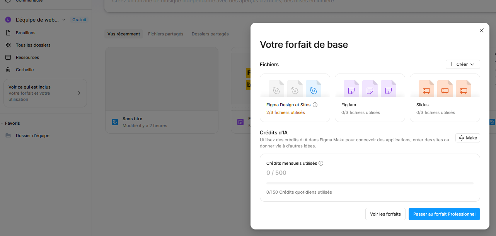

# Introduction à Figma

## Accès à l'application : 
[https://www.figma.com/fr-fr/](https://www.figma.com/fr-fr/)

Disponible en version web (navigateur), application desktop (Windows/macOS) et appli mobile (visualisation des prototypes).

## Créer un compte Éducation
1. Créer un compte classique (de préférence avec votre **adresse e-mail étudiante** fournie par l'établissement).
2. [Faire vérifier son statut étudiant](https://www.figma.com/education/apply)
   - Sélectionner **Higher Ed** comme type d'établissement.
   - La vérification est gérée par un partenaire (SheerID) : préparez une **carte d'étudiant ou un certificat de scolarité** en cours de validité.
3. Le statut Éducation est valable **1 an**, renouvelable tant que vous êtes étudiant·e (il faut refaire la demande).

> ⚠️ En cas de refus ou de problème de vérification, le recours se fait directement auprès du support SheerID (lien fourni dans l'e-mail de réponse).

### Pourquoi le compte Éducation ?
 
| | Compte gratuit (Starter) | Compte Éducation |
|---|---|---|
| Fichiers de design | 3 maximum | **Illimités** |
| Pages par fichier | 3 maximum | **Illimitées** |
| Historique de versions | 30 jours | **Complet** |
| Équipes / bibliothèques partagées | Limité | **Inclus** |
 
> Le compte Éducation donne accès aux fonctionnalités de la version professionnelle. Il est réservé à un **usage pédagogique** : pas de travaux commerciaux ou de missions freelance avec ce compte.

Compte gratuit (non étudiant) : 

Compte étudiant :  

### Figma, pour faire quoi ?
- **Concevoir des interfaces** multi-plateformes (sites web, applications mobiles, logiciels…).
- **Collaborer en temps réel** : travailler simultanément sur le même projet.
- **Prototyper des interactions** : simuler des transitions et des parcours utilisateur sans écrire de code.
  
### Un outil professionnel
- Massivement utilisé dans les agences web, studios de design UI/UX et services numériques d'entreprise.
- Accessible aux débutants mais aussi puissant pour des projets complexes.
- Outil central dans les workflows de conception centrée utilisateur (UX/UI).
  
### L'écosystème Figma
Le compte donne accès à plusieurs outils complémentaires :
- **Figma Design** : conception d'interfaces et prototypage.
- **FigJam** : tableau blanc collaboratif (idéation, brainstorming, wireframes rapides).
- **Figma Slides** : création de présentations.
- **Dev Mode** : inspection des maquettes côté développeur (mesures, code CSS…).
  
### Alternatives et concurrents
- **Penpot** : alternative **libre et open source**, hébergeable soi-même — à connaître.
- **Sketch** (macOS uniquement), **Framer** (orienté sites publiés).
- *Adobe XD* : historiquement le concurrent principal, mais n'est plus développé activement.
  
### Quelques notions à connaître
- **Frame** : conteneur (équivalent d'un écran ou d'une zone).
- **Composant** : élément réutilisable (bouton, carte…) dont les copies se mettent à jour automatiquement et simultanément.
- **Auto layout** : disposition automatique des éléments (marges, alignements, redimensionnement).
- La **sauvegarde est automatique** (fichiers dans le cloud).
  
## Bonnes pratiques
- **Nommer et organiser ses calques et frames** correctement (mêmes logiques que pour les fichiers : noms explicites, cohérents, sans accents ni espaces pour les exports — ex. `btn-primaire`, `header-mobile`).
- **Créer des points d'historique** aux étapes clés : *Fichier → Enregistrer dans l'historique des versions* (`Ctrl/Cmd + Alt + S`), avec un titre descriptif.
- **Commenter** les projets et les modifications (mode commentaire : touche `C`).
- **Partager via un simple lien**, en gérant les droits d'accès (lecture seule ou édition).
