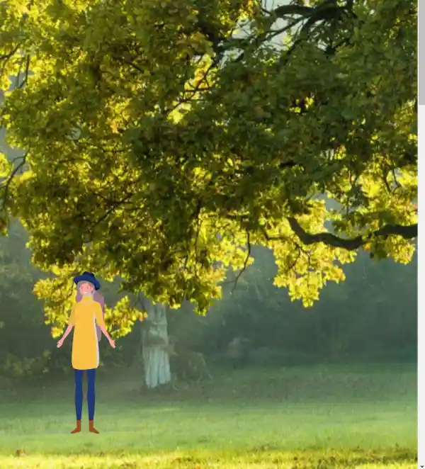

# SkrollR - Faire bouger un personnage

>- Créer une structure HTML
>- Connecter un fichier CSS
>- Connecter le fichier JS et l'avoir activé (lignes du bas)
>- Avoir une image de personnage


**Voici le code du HTML, nous pouvons y retrouver le lien CSS, le JS, le fond de l'exemple précédent et une image.**

```html
<!doctype html>
<html lang="fr">
<head>
    <meta charset="UTF-8">
    <meta name="viewport"
          content="width=device-width, user-scalable=no, initial-scale=1.0, maximum-scale=1.0, minimum-scale=1.0">
    <meta http-equiv="X-UA-Compatible" content="ie=edge">
    <title>Document</title>
    <link rel="stylesheet" href="style.css">
</head>
<body data-0="background-position-X:0px" data-3000="background-position-X:-3000px">

    

<script src="js/skrollr.js"></script>
<script type="text/javascript">
    var s = skrollr.init();
</script>

</body>
</html>
```

**Voici le code CSS du personnage**

```css
#personnage {
    height: 400px;
}
```

Nous obtenons pour le moment ceci : 


**Revenons sur le code précédent :**

L'image que nous avons inséré est au format svg (vectoriel) ce qui va nous permettre de la mettre à la taille de notre choix.

Elle possède un attribut ```src``` avec le chemin de l'image, un attribut ```alt``` pour l'accessibilité, et un ```id``` pour pouvoir la cibler avec le css.

Dans le CSS, nous n'avons pour le moment spécifié qu'une taille, 400px de hauteur, pour notre image. Cette taille peut être librement choisie.

## Positionner le personnage

Pour positionner le personnage à l'emplacement de notre choix, nous allons utiliser la propriété ```position:fixed``` qui permet de positionner un élément à l'emplacement de notre choix.

**Voici le nouveau CSS :** 

```css
#personnage {
    height: 400px;
    position: fixed;
    bottom: 20px;
}
```

Nous obtenons alors ceci :


Nous avons positionné l'image à 20px du bas (bottom). 

Les propriétés qui nous permettent de positionner avec ```position:fixed``` sont les suivantes :

```bottom:...``` -> Distance entre **le bord bas** de l'élément et **le bas** de l'écran

```top:...``` -> Distance entre **le bord haut** de l'élément et **le haut** de l'écran

```left:...``` -> Distance entre **le bord gauche** de l'élément et **la gauche** de l'écran

```right:...``` -> Distance entre **le bord droit** de l'élément et **la droite** de l'écran

## Faire bouger le personnage

Pour faire bouger le personnage, il ne nous reste plus qu'à le déplacer avec les propriétés ci-dessus dans les ```data-```

``````



## Propriétés complémentaires

```opacity:[ 0 à 1 ]``` -> Permet de changer l'opacité, 0 = 0%, 0.3 = 30%,...,1 = 100%

```display:[block, flex, none]``` -> Permet de masquer ou d'afficher un élément
